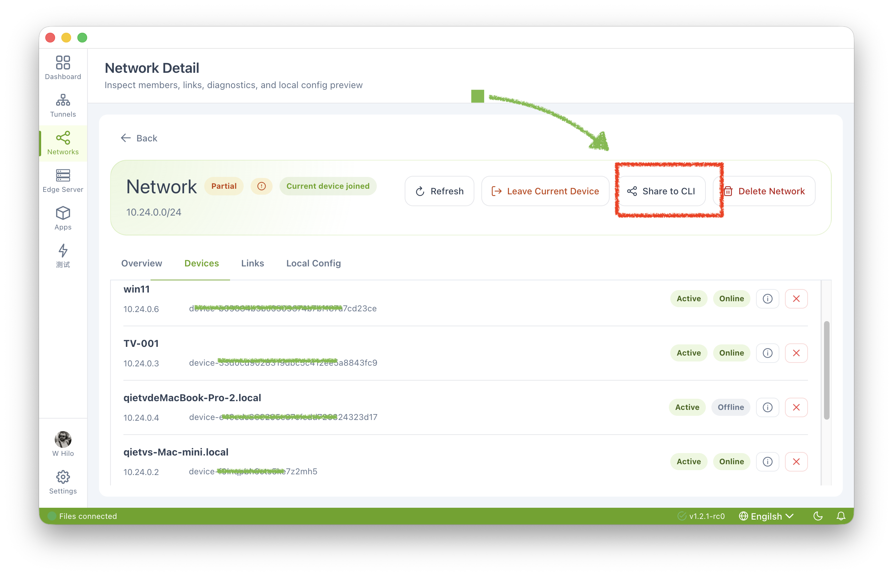

# yat-fe-linux
Yat client for linux

YAT Linux Client (`yat-client`) is the native Linux client for the YAT platform. It provides WireGuard networking capabilities and a built-in Web Dashboard for management. Docker images support amd64, arm64, and armv7; standalone binaries are listed for amd64 and arm64.

---

## Quick Start

Get a Linux machine connected to your YAT WireGuard network in three steps:

```bash
# 1. Start the client (Docker)
docker run -d --name yat-client \
  --cap-add NET_ADMIN \
  --device /dev/net/tun \
  -p 9909:9909 \
  ghcr.io/tunnel6/yat-client-linux:latest

# 2. Open the Dashboard in your browser
#    http://<your-linux-ip>:9909

# 3. Upload share.json in the Settings tab — the client connects automatically
```


> **Tip**: Export `share.json` from the desktop app (macOS/Windows) and import it via the Dashboard or CLI.

## Export Network Configuration

In the desktop app, open **Networks** → **Detail** → **Share to CLI** to export `share.json`, then import the file into the Linux client.



---

## Requirements

| Item | Requirement |
|------|-------------|
| **OS** | Linux (x86_64 / aarch64) |
| **Kernel** | Host kernel must support WireGuard; load the `wireguard` module on the host if it is not built in or loaded automatically |
| **Docker** | Docker 20.10+ (when running via Docker) |
| **Privileges** | `root` or `CAP_NET_ADMIN` (required for WireGuard interface creation) |
| **Network** | Reachable YAT Edge server (port determined by Edge config) |
| **Memory** | Minimum 64 MB available |

### Additional Docker Permissions

The `wireguard` kernel module belongs to the host, not the container image. If it is not built into or automatically loaded by the host kernel, load it on the host before starting the container:

```bash
sudo modprobe wireguard
```

```bash
# Required Docker permissions for the TUN interface and route configuration
--cap-add NET_ADMIN \
--device /dev/net/tun
```

---

## Running the Client

### Option 1: Docker (Recommended)

#### Pull Image

```bash
# Pull from GitHub Container Registry (supports amd64 / arm64)
docker pull ghcr.io/tunnel6/yat-client-linux:latest
```

#### Start Container

```bash
# Port mapping mode (default Dashboard port: 9909)
docker run -d --name yat-client \
  --cap-add NET_ADMIN \
  --device /dev/net/tun \
  -p 9909:9909 \
  ghcr.io/tunnel6/yat-client-linux:latest

# Optional host network mode (shares the host network namespace; omit -p)
docker run -d --name yat-client \
  --cap-add NET_ADMIN \
  --device /dev/net/tun \
  --network host \
  ghcr.io/tunnel6/yat-client-linux:latest
```

#### Custom Port

```bash
# Change the Web UI listen port
docker run -d --name yat-client \
  --cap-add NET_ADMIN \
  --device /dev/net/tun \
  -p 8080:8080 \
  ghcr.io/tunnel6/yat-client-linux:latest \
  yat-client serve --listen 0.0.0.0:8080
```

#### Persist Configuration

```bash
# Mount config directory to survive container restarts
docker run -d --name yat-client \
  --cap-add NET_ADMIN \
  --device /dev/net/tun \
  -p 9909:9909 \
  -v ~/.config/yat-cli:/root/.config/yat-cli \
  ghcr.io/tunnel6/yat-client-linux:latest
```

#### View Logs

```bash
docker logs -f yat-client
```

---

### Option 2: CLI Binary

#### Download Binary

```bash
# Download the binary for your architecture (x86_64 example)
chmod +x yat-client
```

#### CLI Command Reference

| Command | Description |
|---------|-------------|
| `yat-client import <share.json>` | Import a network configuration package |
| `yat-client serve [--listen ADDR]` | Start daemon with Web Dashboard |
| `yat-client start` | Foreground connection mode (no Web UI) |
| `yat-client status` | Show current network status |
| `yat-client leave` | Leave network and teardown WireGuard interface |
| `yat-client cert-info` | Display certificate information |

#### Typical Workflow

```bash
# 1. Import network config (share.json exported from desktop app)
sudo yat-client import share.json

# 2. Start the daemon (default listen: 0.0.0.0:9909)
sudo yat-client serve

# Or specify a custom listen address
sudo yat-client serve --listen 0.0.0.0:8080

# 3. Open the Dashboard in your browser
#    http://<your-linux-ip>:9909
```

> **Note**: The `import` and `serve` commands require root privileges to create the WireGuard network interface.

#### Foreground Mode (No Web UI)

```bash
# Suitable for scripting or temporary use
sudo yat-client start
# Press Ctrl+C to disconnect
```

#### Check Status

```bash
sudo yat-client status
```

Example output:

```
Network:    net-xxxxxxxxxxxx
Member:     member-xxxxxxxx
Interface:  yat0 (kernel)
Address:    10.0.0.5
Peers:      3
Connected:  yes

── WireGuard Engine ──
Backend:    wireguard
Interface:  yat0 (kernel)
Address:    10.0.0.5
Public key: abcdef1234567890...
Peers:      3

── Live Stats ──
Backend:    wireguard (yat0)
Peers:      3
  [server-a] ep=1.2.3.4:51820 rx=12.3MB tx=5.6MB
  [server-b] ep=5.6.7.8:51820 rx=8.1MB tx=3.2MB
  [server-c] ep=relay.yat.io:443 rx=0.5MB tx=0.3MB
```

---

## Web Dashboard Guide

After starting the `serve` command, a feature-rich Web Dashboard is available in your browser.

### Dashboard Tab

- **Network Info** — View Network ID, Member ID, assigned IP address, interface name, and other core details
- **Network Status** — Real-time connection status, online peer count, last sync timestamp
- **Peers** — Complete peer list with hostname, IP address, endpoint, and RX/TX traffic statistics
- **Certificate** — Certificate details (Subject / Issuer / Validity / Fingerprint) with one-click renewal
- **Latest Logs** — Last 50 runtime log entries, color-coded by severity (INFO / WARN / ERROR)

### Settings Tab

- **Edge Connection** — View Edge server host, port, and Edge ID
- **Identity** — View User ID, Device ID, and hostname
- **Import** — Open the Linux agent Dashboard (for example, `http://<linux-agent-ip>:9909`), then use the import control at the bottom of the Settings page to upload `share.json`; the service restarts automatically after import


- **Reconnect** — Manually trigger Edge reconnection (useful when disconnected)
- **Update Address** — Dynamically change this device's IP address within the network

### Dashboard Highlights

- Dark theme with YAT green accent (#22c55e)
- Auto-refresh status data every 5 seconds
- Zero-config startup — launch the Dashboard first, then import config via the Web UI
- Automatic certificate monitoring — checks hourly, auto-renews when nearing expiry (requires OAuth credentials)
- Auto-reconnect on disconnect — exponential backoff strategy, up to 10 retries before entering a 30-minute cooldown

---

## Configuration

Configuration files are stored in `~/.config/yat-cli/`:

```
~/.config/yat-cli/
├── config.json          # Main config (Edge connection + identity)
├── device-id            # Local device ID (stable across re-imports)
├── device-identity.json # Device identity (associated with WG key pair)
└── certs/
    ├── ca.crt           # CA certificate
    ├── captain-ca.crt   # Captain CA certificate
    ├── client.crt       # Client certificate
    └── client.key       # Client private key
```

---

## Release Notes

### v1.0.0

| libc | Architecture | Base image | Platform |
|------|--------------|------------|----------|
| musl | amd64 | `alpine:3.20-amd64` | `linux/amd64` |
| musl | arm64 | `alpine:3.20-arm64` | `linux/arm64` |
| GNU | amd64 | `debian:bookworm-slim-amd64` | `linux/amd64` |
| GNU | arm64 | `debian:bookworm-slim-arm64` | `linux/arm64` |
| GNU | armv7 | `debian:bookworm-slim-armv7` | `linux/arm/v7` |

## Architecture Support

| Architecture | Docker Image | Binary |
|-------------|-------------|--------|
| linux/amd64 (x86_64) | ✅ | ✅ |
| linux/arm64 (aarch64) | ✅ | ✅ |
| linux/arm/v7 (armv7) | ✅ | Not listed |

Image variants use Alpine 3.20 (musl libc) or Debian Bookworm slim (GNU libc).

---

## FAQ

**Q: Why does it need root privileges?**  
A: WireGuard requires creating a TUN network interface and configuring routes, which need kernel-level network management permissions.

**Q: Configuration lost after container restart?**  
A: Mount a persistent volume with `-v ~/.config/yat-cli:/root/.config/yat-cli`.

**Q: What if the certificate expires?**  
A: If imported via `share.json` (with OAuth credentials), the system auto-renews. Otherwise, re-export from the desktop app and re-import.

**Q: How to run in the background?**  
A: Use Docker (`docker run -d`), or `nohup sudo yat-client serve &`. You can also create a systemd service unit.
