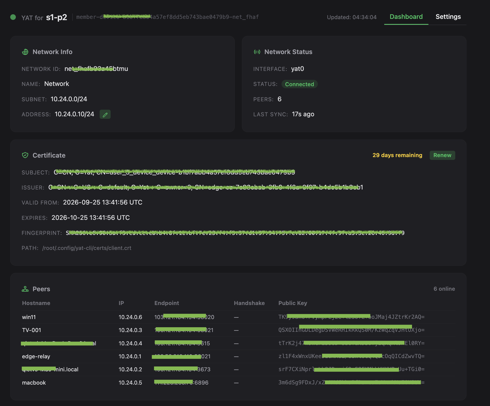
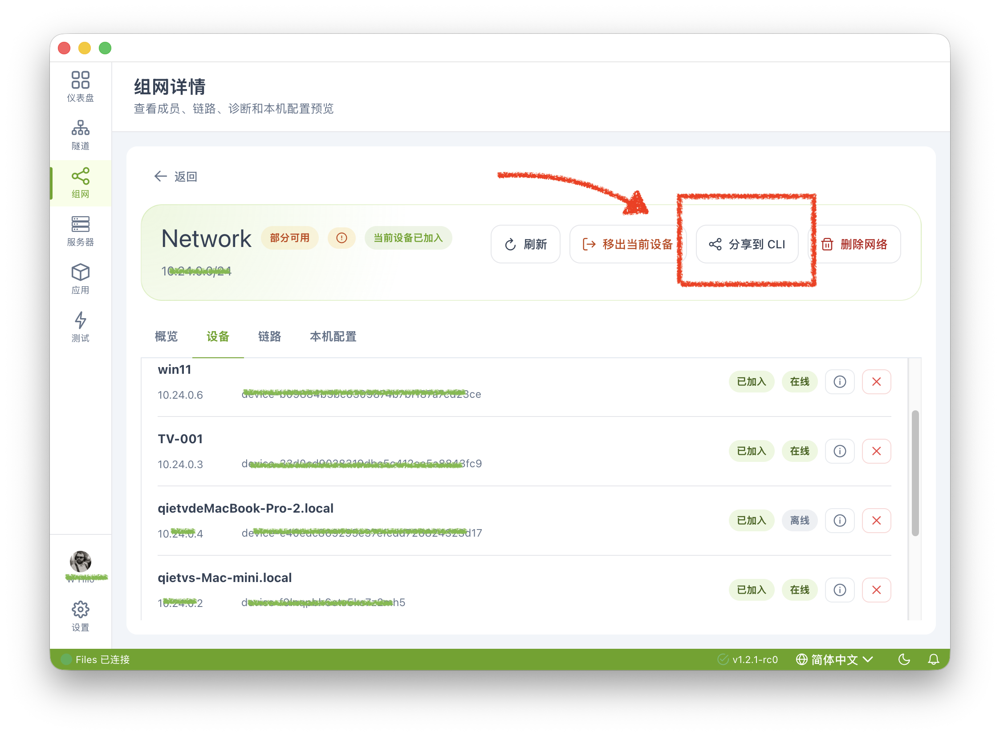
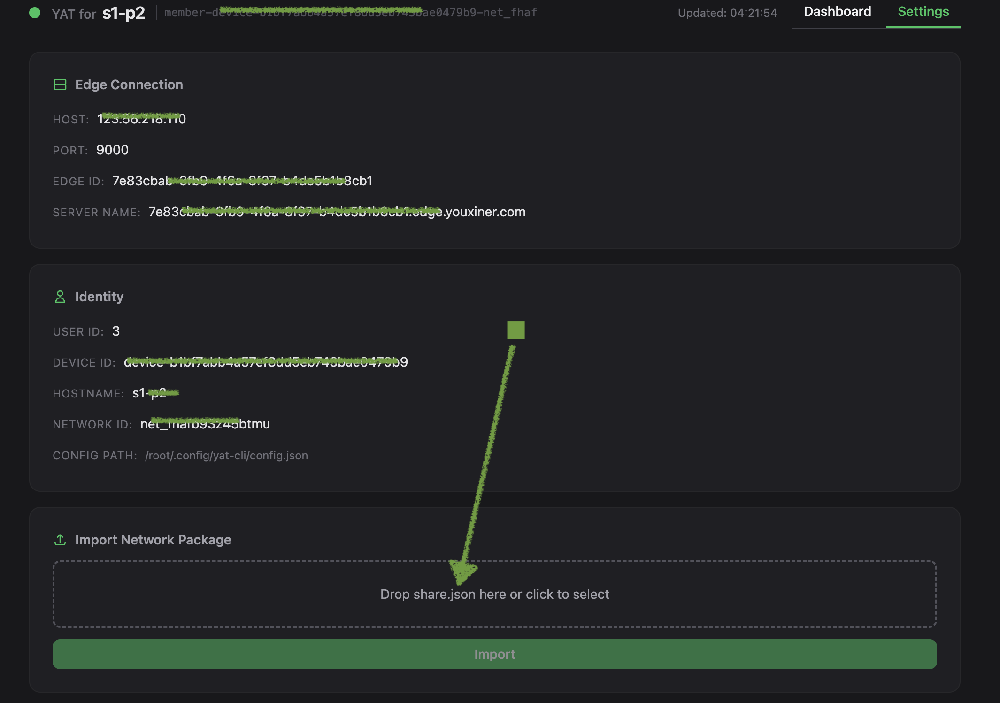

# YAT Linux Client 发布说明

YAT Linux Client (`yat-client`) 是 YAT 平台的 Linux 原生客户端，提供 WireGuard 组网能力与 Web 管理界面。支持 x86_64 / arm64 双架构，可通过 Docker 或二进制文件直接运行。

---

## 快速开始

只需三步，即可将一台 Linux 机器接入 YAT WireGuard 网络：

```bash
# 1. 启动客户端（Docker 方式）
docker run -d --name yat-client \
  --cap-add NET_ADMIN \
  --device /dev/net/tun \
  -p 9909:9909 \
  registry.cn-beijing.aliyuncs.com/pei/yat-fe-linux:latest

# 2. 打开浏览器访问 Dashboard，导入网络配置
#    http://<your-linux-ip>:9909

# 3. 在 Dashboard 的 Settings 页面上传 share.json，客户端自动连接
```



> **提示**：也可以从桌面端 (macOS/Windows) 导出 `share.json`，通过 Dashboard 或 CLI 导入。

## 导出网络配置

在桌面端依次打开 **Networks** → **Detail** → **Share to CLI**，导出 `share.json`，再将文件导入 Linux 客户端。



---

## 系统要求

| 项目 | 要求 |
|------|------|
| **操作系统** | Linux (x86_64 / aarch64) |
| **内核模块** | WireGuard (`wireguard-tools`) |
| **Docker** | Docker 20.10+（Docker 方式运行时需要） |
| **权限** | `root` 或 `CAP_NET_ADMIN`（创建 WireGuard 网卡需要） |
| **网络** | 可访问 YAT Edge 服务器（默认端口由 Edge 配置决定） |
| **内存** | 最低 64 MB 可用内存 |

### Docker 运行所需的额外权限

```bash
# WireGuard 需要 TUN 设备和网络管理能力
--cap-add NET_ADMIN \
--device /dev/net/tun
```

---

## 运行方式

### 方式一：Docker 运行（推荐）

#### 拉取镜像

```bash
# 从阿里云镜像仓库拉取（支持 amd64 / arm64）
docker pull registry.cn-beijing.aliyuncs.com/pei/yat-fe-linux:latest
```

#### 启动容器

```bash
# 基础启动（端口映射模式）
docker run -d --name yat-client \
  --cap-add NET_ADMIN \
  --device /dev/net/tun \
  -p 9909:9909 \
  registry.cn-beijing.aliyuncs.com/pei/yat-fe-linux:latest

# Host network 模式（推荐，性能更好）
docker run -d --name yat-client \
  --cap-add NET_ADMIN \
  --device /dev/net/tun \
  --network host \
  registry.cn-beijing.aliyuncs.com/pei/yat-fe-linux:latest
```

#### 自定义端口

```bash
# 修改 Web UI 监听端口
docker run -d --name yat-client \
  --cap-add NET_ADMIN \
  --device /dev/net/tun \
  -p 8080:8080 \
  registry.cn-beijing.aliyuncs.com/pei/yat-fe-linux:latest \
  yat-client serve --listen 0.0.0.0:8080
```

#### 持久化配置

```bash
# 挂载配置目录，避免重启后丢失
docker run -d --name yat-client \
  --cap-add NET_ADMIN \
  --device /dev/net/tun \
  -p 9909:9909 \
  -v ~/.config/yat-cli:/root/.config/yat-cli \
  registry.cn-beijing.aliyuncs.com/pei/yat-fe-linux:latest
```

#### 查看日志

```bash
docker logs -f yat-client
```

---

### 方式二：CLI 直接运行

#### 下载二进制

```bash
# 下载对应架构的二进制文件（以 x86_64 为例）
chmod +x yat-client
```

#### CLI 命令一览

| 命令 | 说明 |
|------|------|
| `yat-client import <share.json>` | 导入网络配置包 |
| `yat-client serve [--listen ADDR]` | 启动守护进程 + Web 管理界面 |
| `yat-client start` | 前台连接模式（无 Web UI） |
| `yat-client status` | 查看当前网络状态 |
| `yat-client leave` | 离开网络并拆除 WireGuard 接口 |
| `yat-client cert-info` | 查看证书信息 |

#### 典型使用流程

```bash
# 1. 导入网络配置（从桌面端导出的 share.json）
sudo yat-client import share.json

# 2. 启动守护进程（默认监听 0.0.0.0:9090）
sudo yat-client serve

# 或指定监听地址
sudo yat-client serve --listen 0.0.0.0:8080

# 3. 浏览器打开 Dashboard
#    http://<your-linux-ip>:9090
```

> **注意**：`import` 和 `serve` 命令需要 root 权限来创建 WireGuard 网络接口。

#### 前台模式（无 Web UI）

```bash
# 适合脚本化或临时使用
sudo yat-client start
# 按 Ctrl+C 断开连接
```

#### 查看状态

```bash
sudo yat-client status
```

输出示例：

```
Network:    net-xxxxxxxxxxxx
Member:     member-xxxxxxxx
Interface:  yat0 (userspace)
Address:    10.0.0.5
Peers:      3
Connected:  yes

── WireGuard Engine ──
Backend:    boringtun
Interface:  yat0 (userspace)
Address:    10.0.0.5
Public key: abcdef1234567890...
Peers:      3

── Live Stats ──
Backend:    boringtun (yat0)
Peers:      3
  [server-a] ep=1.2.3.4:51820 rx=12.3MB tx=5.6MB
  [server-b] ep=5.6.7.8:51820 rx=8.1MB tx=3.2MB
  [server-c] ep=relay.yat.io:443 rx=0.5MB tx=0.3MB
```

---

## Web Dashboard 功能介绍

启动 `serve` 命令后，可通过浏览器访问功能丰富的 Web 管理界面。

### Dashboard 标签页

- **Network Info** — 查看网络 ID、成员 ID、分配地址、接口名称等核心信息
- **Network Status** — 实时连接状态、在线 Peer 数量、最后同步时间
- **Peers** — 完整的 Peer 列表，包含主机名、IP 地址、Endpoint、收发流量统计
- **Certificate** — 证书详情（Subject / Issuer / 有效期 / 指纹），支持一键续期
- **Latest Logs** — 最近 50 条运行日志，按 INFO / WARN / ERROR 分级着色

### Settings 标签页

- **Edge Connection** — 查看 Edge 服务器地址、端口、Edge ID
- **Identity** — 查看用户 ID、设备 ID、主机名
- **Import** — 访问 Linux agent 的 Dashboard（例如 `http://<linux-agent-ip>:9909`），打开 Settings 页面并在底部的导入控件上传 `share.json`；导入后自动重启服务


- **Reconnect** — 手动触发重连（断线时可用）
- **Update Address** — 动态修改设备在网络中的 IP 地址

### Dashboard 特性

- 暗色主题，YAT 绿色风格
- 5 秒自动刷新状态数据
- 支持无配置启动 — 先启动 Dashboard，再通过 Web 界面导入配置
- 证书到期自动监控 — 每小时检查，临近过期自动续期（需 OAuth 凭据）
- 断线自动重连 — 指数退避策略，最多重试 10 次后进入 30 分钟等待

---

## 配置说明

配置文件存储在 `~/.config/yat-cli/` 目录下：

```
~/.config/yat-cli/
├── config.json          # 主配置文件（Edge 连接 + 身份信息）
├── device-id            # 本地设备 ID（稳定，跨导入不变）
├── device-identity.json # 设备身份（WG 密钥对关联）
└── certs/
    ├── ca.crt           # CA 证书
    ├── captain-ca.crt   # Captain CA 证书
    ├── client.crt       # 客户端证书
    └── client.key       # 客户端私钥
```

---

## 架构支持

| 架构 | Docker 镜像 | 二进制文件 |
|------|-------------|-----------|
| linux/amd64 (x86_64) | ✅ | ✅ |
| linux/arm64 (aarch64) | ✅ | ✅ |

Docker 镜像基于 Alpine 3.20（musl libc），体积极小。

---

## 常见问题

**Q: 为什么需要 root 权限？**  
A: WireGuard 需要创建 TUN 网络接口并配置路由，这些操作需要内核级网络管理权限。

**Q: Docker 容器重启后配置丢失？**  
A: 请挂载持久化卷 `-v ~/.config/yat-cli:/root/.config/yat-cli`。

**Q: 证书过期了怎么办？**  
A: 如果通过 `share.json` 导入（含 OAuth 凭据），系统会自动续期。否则需从桌面端重新导出并导入。

**Q: 如何在后台运行？**  
A: 使用 Docker 方式（`docker run -d`），或使用 `nohup sudo yat-client serve &`。也可以创建 systemd service。
